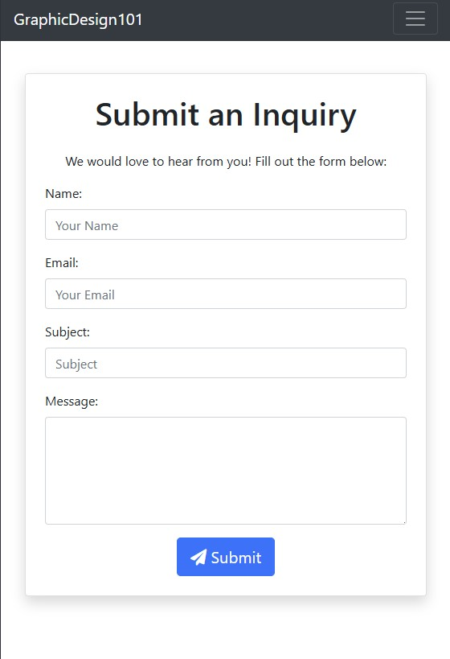

Graphic Design 101
==================

## Screenshots & Previews
Here are some screenshots showcasing the functionality of **Graphic Design 101**:

### Home Page


### Portfolio Section


### Order Page


### Admin Panel


Table of Contents
-----------------

-   Project Overview

-   Features

-   Technologies Used

-   Installation

-   Usage

-   Environment Variables

-   Deployment

-   Admin Panel

-   Project Structure

-   Future Improvements

-   License

* * * * *

Project Overview
----------------

Graphic Design 101 is a full-stack web application that provides a platform for users to browse and order graphic design services. The platform offers a variety of design categories such as logo creation, poster design, and more. Users can also submit inquiries and receive responses via the admin panel.

* * * * *

Features
--------

-   User authentication (signup, login, logout)

-   Order management system

-   Inquiry submission and admin reply functionality

-   Portfolio showcase with images

-   Shopping cart and checkout with Stripe payment integration

-   Admin dashboard for managing orders and inquiries

-   Responsive design for all devices

* * * * *

Technologies Used
-----------------

-   **Frontend:** HTML, CSS, JavaScript, Bootstrap

-   **Backend:** Python, Django

-   **Database:** PostgreSQL

-   **Deployment:** Heroku

-   **Version Control:** Git and GitHub

-   **Payment Processing:** Stripe API

* * * * *

Installation
------------

### Prerequisites

Ensure you have the following installed on your system:

-   Python 3.12+

-   PostgreSQL

-   Git

### Steps

1.  Clone the repository:

    ```
    git clone https://github.com/yourusername/graphicdesign101.git
    cd graphicdesign101
    ```

2.  Create a virtual environment:

    ```
    python -m venv venv
    source venv/bin/activate  # On Windows use `venv\Scripts\activate`
    ```

3.  Install dependencies:

    ```
    pip install -r requirements.txt
    ```

4.  Configure environment variables:

    ```
    export SECRET_KEY='your-secret-key'
    export EMAIL_PASSWORD='your-email-password'
    export DATABASE_URL='your-database-url'
    ```

5.  Apply database migrations:

    ```
    python manage.py makemigrations
    python manage.py migrate
    ```

6.  Create a superuser for admin access:

    ```
    python manage.py createsuperuser
    ```

7.  Run the development server:

    ```
    python manage.py runserver
    ```

    Access the site at `http://127.0.0.1:8000`

* * * * *

Usage
-----

1.  Browse available graphic design services.

2.  Register or login to place an order.

3.  Admin can manage inquiries and reply via the admin panel.

4.  Proceed to checkout using Stripe integration.

* * * * *

Environment Variables
---------------------

Create a `.env` file in the root directory and add:

```
SECRET_KEY=your-secret-key
DEBUG=True
DATABASE_URL=your-database-url
EMAIL_HOST_USER=graphic.design.101.mark@gmail.com
EMAIL_PASSWORD=your-email-password
STRIPE_PUBLIC_KEY=your-stripe-public-key
STRIPE_SECRET_KEY=your-stripe-secret-key
```

* * * * *

Deployment
----------

### Heroku Deployment Steps

1.  Install Heroku CLI and log in:

    ```
    heroku login
    ```

2.  Create a new Heroku app:

    ```
    heroku create graphicdesign101
    ```

3.  Set environment variables:

    ```
    heroku config:set SECRET_KEY='your-secret-key'
    heroku config:set EMAIL_PASSWORD='your-email-password'
    heroku config:set DATABASE_URL='your-database-url'
    ```

4.  Push the code to Heroku:

    ```
    git push heroku main
    ```

5.  Run database migrations:

    ```
    heroku run python manage.py migrate
    ```

* * * * *

Admin Panel
-----------

To access the admin panel:

1.  Navigate to `http://127.0.0.1:8000/admin/`

2.  Use the credentials created during the superuser setup.

* * * * *

Project Structure
-----------------

```
graphicdesign101/
|-- home/
|   |-- migrations/
|   |-- static/
|   |-- templates/
|   |-- admin.py
|   |-- apps.py
|   |-- models.py
|   |-- views.py
|-- graphicdesign/
|   |-- settings.py
|   |-- urls.py
|   |-- wsgi.py
|-- static/
|-- templates/
|-- manage.py
|-- requirements.txt
```

* * * * *

Future Improvements
-------------------

-   Add social media authentication

-   Implement a review and rating system for projects

-   Enhance UI/UX with animations and improved design